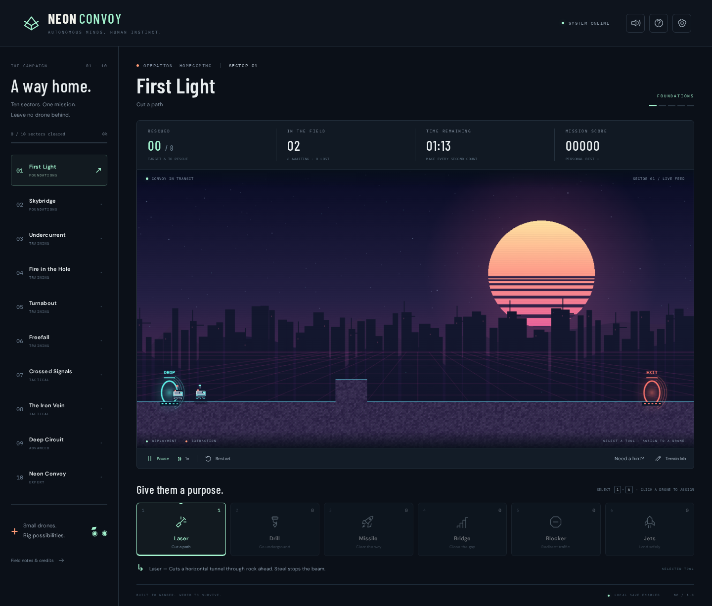

# NEON CONVOY

**Autonomous minds. Human instinct.**

A complete browser rescue-puzzle game inspired by the terrain and crowd-management puzzles of Lemmings. Your convoy is a fleet of animated AI rover drones: assign industrial tools, cut a route through the terrain, build crossings, and bring enough drones to the extraction gate before the clock runs out.

## Play immediately

1. Download this repository with **Code → Download ZIP** and extract it.
2. Open **[play.html](play.html)** in a current Chrome, Edge, Firefox, or Safari browser.
3. Choose **Deploy convoy**. Select a tool, then click or tap a drone.

`play.html` is a self-contained build. Gameplay, sprites, and music run locally without a server or external media. Optional Google Fonts improve the typography when online; system fonts work offline. The browser enables audio after your first interaction. Progress is saved in browser storage when available; private browsing and local-file storage rules can affect persistence.



## Your toolkit

| Key | Tool | Use |
| --- | --- | --- |
| 1 | Laser | Cut a horizontal tunnel through rock ahead. |
| 2 | Drill | Open a shaft through the ground beneath a drone. |
| 3 | Missile | Fire a projectile that blasts away an obstacle. |
| 4 | Bridge | Build a rising staircase across a gap. Start before the edge. |
| 5 | Blocker | Stop a drone and reverse approaching traffic. Assign Blocker again to release it for free. |
| 6 | Jets | Give a drone permanent protection against long falls. |

Drones drive on their own, turn at walls, and fall off ledges. Tool charges are shared and limited. Violet rock can be removed; striped steel survives destruction. Orange conduits are fatal. Select a tool before clicking a drone. You can assign while paused.

- **Space:** play/pause. **F:** toggle 2× speed. **R:** restart. **M:** mute/unmute.
- **Need a hint?** gives each sector's tactical guidance.
- **Terrain lab** lets you paint and erase terrain with an adjustable brush, even before deployment. Edited runs are practice runs and do not set campaign records. Restart restores the original terrain.
- Each sector has a rescue target, countdown, score, and personal best. Rescue enough drones to complete it; time left and unused tools contribute to the score.
- All ten sectors are available from the campaign list. Completion and personal bests save automatically. Small screens get a horizontally scrolling sector selector and touch controls.

## Campaign

| Sector | Name | Focus |
| --- | --- | --- |
| 01 | First Light | Learn laser cutting and shared routes. |
| 02 | Skybridge | Construct a crossing over a dangerous gap. |
| 03 | Undercurrent | Drill to the lower route. |
| 04 | Fire in the Hole | Clear a gate with a missile. |
| 05 | Turnabout | Redirect the convoy with a blocker. |
| 06 | Freefall | Equip landing jets before the drop. |
| 07 | Crossed Signals | Combine cutting and construction. |
| 08 | The Iron Vein | Route under steel and clear the lower lane. |
| 09 | Deep Circuit | Combine jets, drilling, and construction. |
| 10 | Neon Convoy | Coordinate laser, bridge, and missile assignments. |

Every level has a distinct original looping synthwave arrangement, synthesized in real time with bass, arpeggios, pads, and drums. The drone art is an original generated sprite sheet with nine animation states and four frames per state. No original Lemmings assets, music, or levels are included.

## Develop

Requires Node.js **22.18 or newer**.

```sh
npm ci
npm run dev
```

Open the URL Vite prints. To build:

```sh
npm run build
```

This produces a deployable static site in `dist/` and regenerates the checked-in standalone `play.html`. Upload `dist/` to any static host, or distribute `play.html`. No backend, accounts, or API keys are needed.

## Validate

```sh
npx playwright install chromium
npm run check
```

Simulation tests verify scripted solutions for all ten levels, persistent terrain edits, tool charges, steel resistance, safe-fall jets, scoring, pause/reset, loss conditions, and blocker release. Browser tests cover desktop and mobile controls, canvas rendering, tool assignment, terrain painting, dialogs, campaign navigation, audio state, and progress persistence. Strict TypeScript checking covers source, tests, scripts, and configuration. Distribution tests exercise the built site and offline standalone file on both viewport profiles. `npm run check` runs all local gates; individual commands are `npm run typecheck`, `npm test`, `npm run build`, `npm run test:browser`, and `npm run test:distribution` (after building).

TypeScript is checked by `tsc`; Vite builds the browser code and Node runs the scripts and simulation tests using native type stripping. Use explicit `.ts` imports and erasable TypeScript syntax. Browser bundles and the generated `play.html` still contain JavaScript.

If Chromium is already installed outside Playwright's expected location, set `PLAYWRIGHT_CHROMIUM_EXECUTABLE_PATH` to its executable before running browser tests.

## Continuous integration

GitHub Actions runs on pull requests (including forks) and pushes to `main`, using Ubuntu and Node 22.18, read-only permissions, timeouts, and cancellation of superseded runs. The small selection job tests the routing rules without installing dependencies. Jobs run only when their inputs change:

| Changed surface | Checks |
| --- | --- |
| Documentation or screenshots | Routing and aggregate only |
| Engine, levels, or shared game types | Types, simulation, browser controls, distribution |
| UI, renderer, audio, or Vite config | Types, browser controls, distribution |
| CSS, entry HTML, or favicon | Browser controls, distribution |
| Simulation test | Types and simulation |
| Browser test | Types and browser controls |
| Standalone script, distribution test/config | Types and distribution |
| Generated `play.html` | Distribution |
| Shared Playwright config | Types, browser controls, distribution |
| Package manifests, TypeScript config, routing code/tests, or CI workflow | All checks |

Mixed changes run the union of their checks. Simulation needs no dependency installation. Browser jobs install the pinned Playwright Chromium and retain failure artifacts for seven days. The distribution job rebuilds and checks that committed `play.html` is current; run `npm run build` and commit the result whenever build inputs change.

For branch protection, require the stable **Game checks** aggregate. It succeeds only when every selected job succeeds and also reports success for documentation-only changes. Avoid requiring the individual conditional jobs. Repository visibility and branch protection are configured separately in GitHub settings.

## Project layout

- `src/engine.ts`: fixed-step simulation, collision, terrain cells, tool behavior, particles, and scoring.
- `src/levels.ts`: ten sector layouts, inventories, briefings, hints, and scripted validation strategies.
- `src/renderer.ts`: Canvas scene, terrain rendering, sprite sheet, and effects.
- `src/audio.ts`: ten original Web Audio arrangements and sound effects.
- `src/main.ts` / `src/style.css`: mission control, responsive controls, terrain lab, dialogs, and persistence.
- `tests/`: simulation and desktop/mobile integration coverage.
- `scripts/standalone.ts`: packages the Vite output as a single playable HTML file.

## Inspiration and credits

Research references are documented in [docs/inspiration.md](docs/inspiration.md): Wikipedia's gameplay overview and footage of the original 1991 game informed autonomous movement, limited skills, terrain puzzles, and progressive teaching. Neon Convoy's names, layouts, art, and audio are original. This project is not affiliated with the owners of Lemmings.
